Road Semantic Segmentation Project

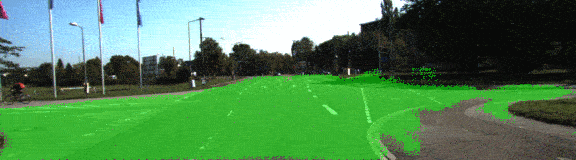

# Overview

The object of this project is to label the pixels of a road image using the Fully Convolutional Network (FCN) described in the [Fully Convolutional Networks for Semantic Segmentation](https://people.eecs.berkeley.edu/~jonlong/long_shelhamer_fcn.pdf) by Jonathan Long, Even Shelhamer, and Trevor Darrel.

# Prerequisites

The frameworks and packages should be installed to execute the code:

- [Python 3](https://www.python.org/)
- [TensorFlow](https://www.tensorflow.org/)
- [NumPy](http://www.numpy.org/)
- [SciPy](https://www.scipy.org/)

I provide an environment configuration on [environment.yml](./environment.yml) in order to reproduce the package selection. I used it to make sure the basic of the code was working properly, but without access to a local GPU, the code ran too slow. To run code properly, I created a Spot instance on AWS `g3.4xlarge`. The only package I have to install manually was (tqdm)[https://pypi.python.org/pypi/tqdm].

The dataset used in this project is the [Kitti Road dataset](http://www.cvlibs.net/datasets/kitti/eval_road.php). It could be download from [here](http://www.cvlibs.net/download.php?file=data_road.zip) or use the script [download_images.sh](./data/download_images.sh).

# Code description

Most of the code is inside [`main.py`](./main.py) [`run`](./main.py#L178) method. The code downloads a pre-trained VGG16 model and extract the input, keep probability, layer 3, layer 4 and layer 7 from it (method [`load_vgg`](./main.py#L20) from line 20 to line 44). Those layers are used in the [`layers`](./main.py#L49) to create the rest of the network:

- One convolutional layer with kernel 1 from VGG's layer 7 ([line 62](./main.py#L62)).
- One deconvolutional layer with kernel 4 and stride 2 from the first convolutional layer ([line 70](./main.py#L70)).
- One convolutional layer with kernel 1 from VGG's layer 4 ([line 78](./main.py#L78)).
- The two layers above are added to create the first skip layer ([line 86](./main.py#L86)).
- One deconvolutional layer with kernel 4 and stride 2 from the first ship layer ([line 88](./main.py#L88)).
- One convolutional layer with kernel 1 from VGG's layer 3 ([line 96](./main.py#L96)).
- The two layers above are added to create the second skip layer ([line 104](./main.py#L104)).
- One deconvolutional layer with kernel 16 and stride 8 from the second skip layer ([line 106](./main.py#L106)).

Every created convolutional and deconvolutional layer use a random-normal kernel initializer with standard deviation 0.01 and a L2 kernel regularizer with L2 0.001.

Once the network structure is defined, the optimizer and the cross-entropy lost is defined on the [`optimize`](./main.py#L116)(from line 116 to line 136) method using [Adam optimizer](https://en.wikipedia.org/wiki/Stochastic_gradient_descent#Adam).

The network is trained using the [`train_nn`](./main.py#L140) (from line 140 to line 174) using keep probability 0.5 and learning rate 0.00001. To facilitate the loss value analysis, later on, every batch loss values are stored in an array, and the array is printed for each epoch.

# Training

The dataset used for training the network was
The network training was done for 6, 12, 24 and 48 epochs. The following graphs show the loss after each epoch:

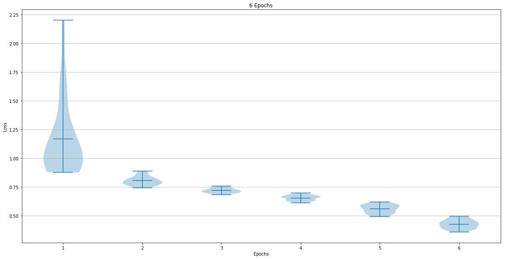

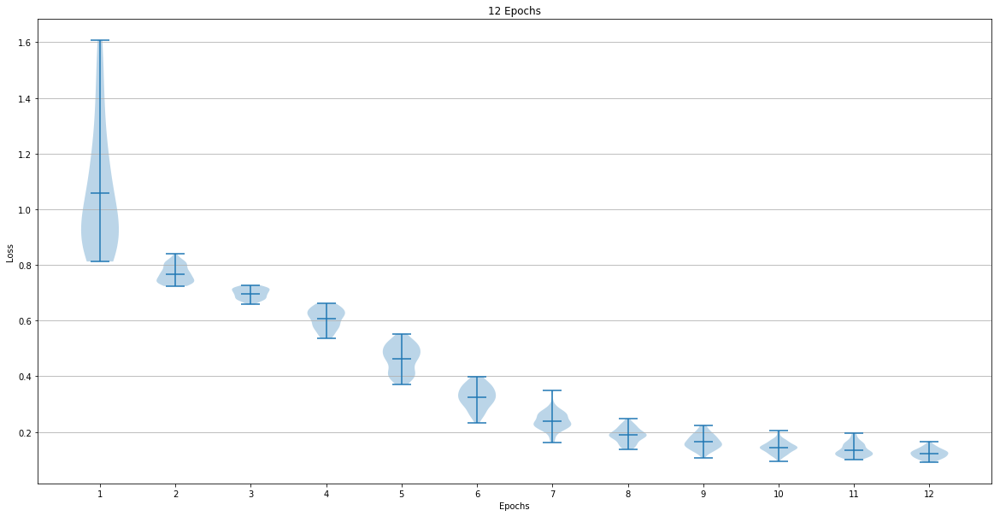

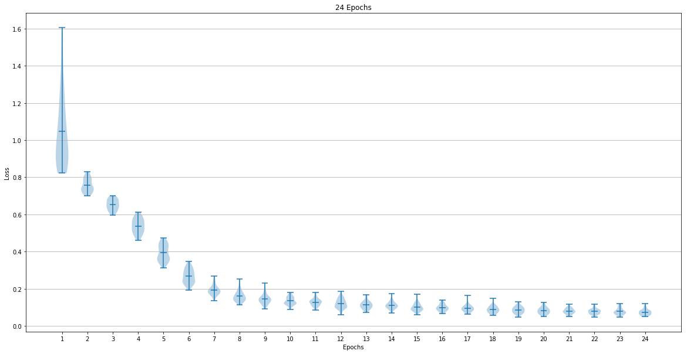

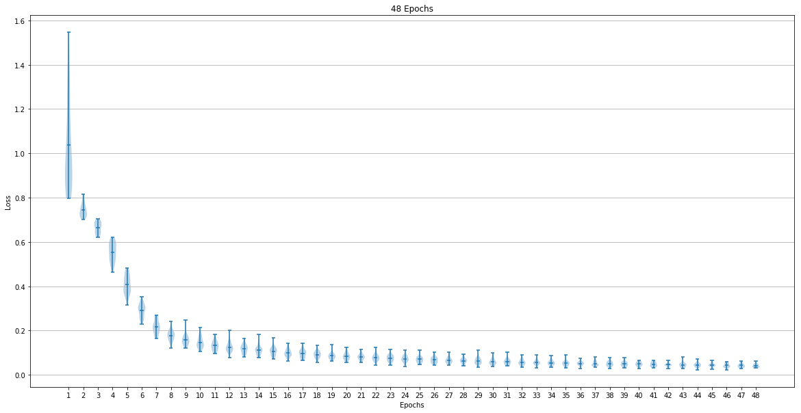

The last epoch loss mean and standard deviation were:

- 6 Epoch   =>    Mean: 0.425847    Std: 0.037720
- 12 Epoch  =>    Mean: 0.122803    Std: 0.016831
- 24 Epoch  =>    Mean: 0.073090    Std: 0.015247
- 48 Epoch  =>    Mean: 0.041946    Std: 0.007950

# Sample images

It was fascinating to see how the segmentation improve when the epochs increase.

## 6 Epochs

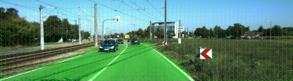
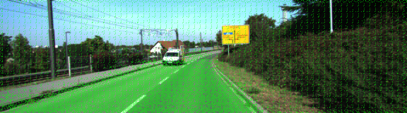
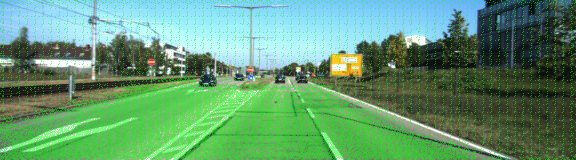
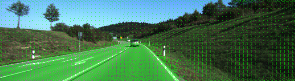
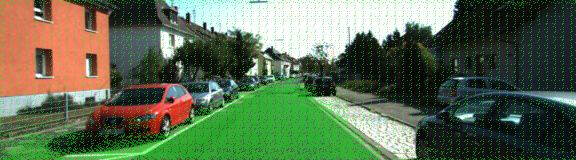
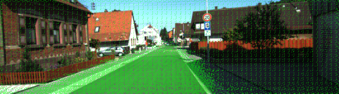

## 12 Epochs

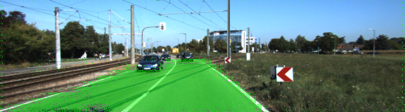
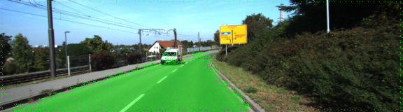
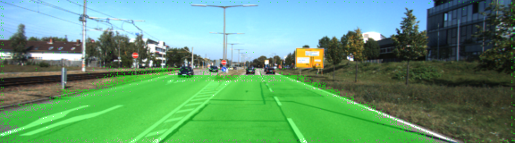
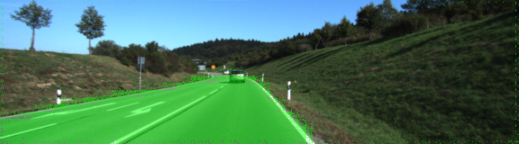
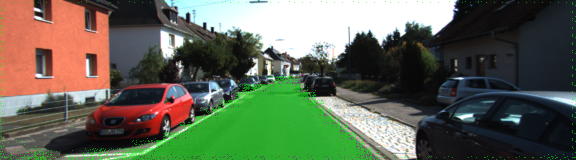
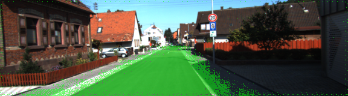

## 24 Epochs

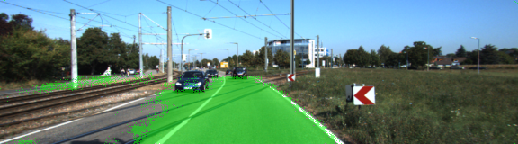

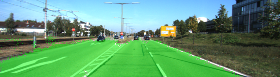
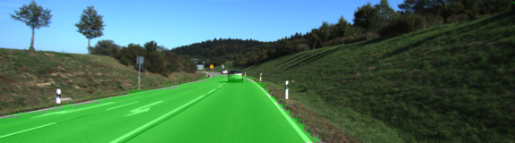

## 48 Epochs

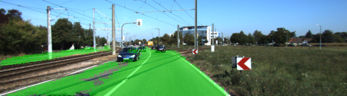
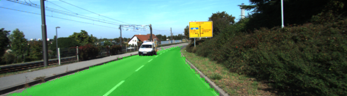
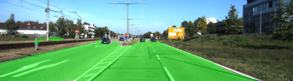

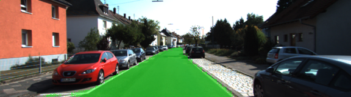
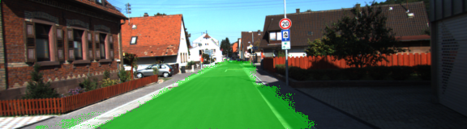
